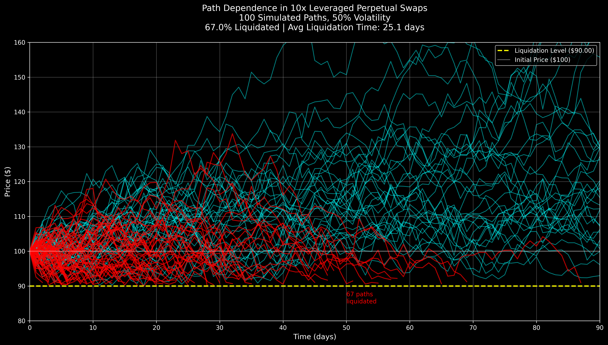
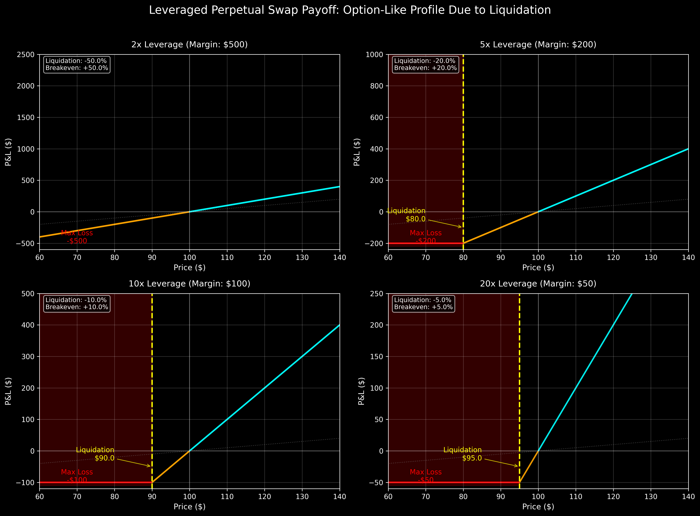
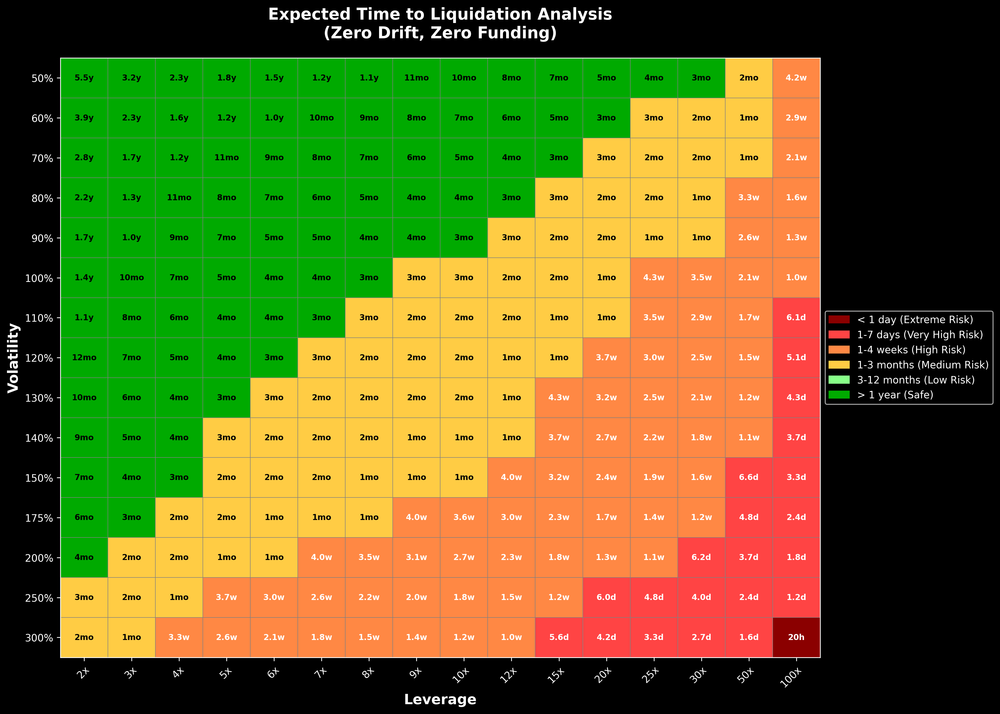
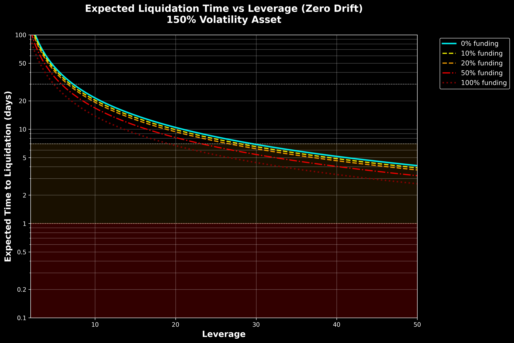

# Leverage and path dependence for perpetual swaps

Perpetual swaps (perps) are broadly considered as delta-one instruments, meaning that they create a 1-1 payoff with the price of the underlying asset. However due to the nature of leverage of most traders of perpetual swaps, the path dependence of the underlying spot asset is important because of the risk of liquidation. The liquidations that happen in perps are either intentional when traders construct the position with a synthetic option payoff in mind or unintentional when traders are forcibly liquidated when their liquidation threshold is hit. This article tries to share some intuition around the path dependence nature of perpetual swaps when using leverage and how they can behave as a synthetic option. 

## What is path dependence and why does it matter?

Path dependence is when the outcome is influenced by the sequence of events that led to it. For a leveraged perp position where the initial margin is not topped up, it means that the sequence of spot price affects which positions survive and which positions get liquidated. For example in the simulation below for a 10x leveraged perpetual swap position for an asset with 50% volatility, we can see positions that were liquidated in red as they did not survive those price paths and the surviving positions in blue that survived the price paths.



If we were to plot the payoff of a leveraged long perpetual swap, we get payoffs similar to a call option payoff in the case where the initial margin is not topped up and the position is liquidated.



## Expected Time to Liquidation

One way to think about a leveraged perpetual swap position is the "Expected Time to Liquidation." Although no perp trader expects to get liquidated, intuition around how long a perp position is expected to survive can provide helpful intuition on the implicit duration of the position expressed. 

---
Crypto price movements are not geometric Brownian motion and have sharp gaps but this is to provide a baseline intuition.

**Key Variables**
- **S₀**: Initial price (entry price)
- **L**: Leverage ratio
- **σ**: Volatility (annualized)
- **μ**: Drift rate (market trend - funding rate)
- **B**: Liquidation barrier = S₀(1 - 1/L)
- **τ**: First passage time (when price first hits B)

**Price Dynamics**

The price follows a geometric Brownian motion:

```
dSₜ = μSₜdt + σSₜdWₜ
```

Where Wₜ is a standard Brownian motion.

Let Xₜ = ln(Sₜ/S₀). By Itô's lemma:

```
dXₜ = (μ - σ²/2)dt + σdWₜ
```

The liquidation barrier in log-space becomes:
```
b = ln(B/S₀) = ln(1 - 1/L)
```

We need to find τ = inf{t ≥ 0 : Xₜ ≤ b}

For a Brownian motion with drift α and volatility σ starting at x₀ = 0, the expected first passage time to level b < 0 is:

```
E[τ] = -b/α,  if α > 0
E[τ] = ∞,     if α ≤ 0
```

In our case:
- Starting point: x₀ = 0 (log of initial price ratio)
- Barrier: b = ln(1 - 1/L) < 0
- Drift: α = μ - σ²/2
- Effective drift for first passage: μ + σ²/2

Using the first passage time formula for geometric Brownian motion:

```
E[τ] = -b/(μ + σ²/2)
     = -ln(1 - 1/L)/(μ + σ²/2)
```

Expected Time to Liquidation:

```
E[τ] = -ln(1 - 1/L) / (μ + 0.5σ²)
```

In practical terms (annualized):
- **L** = Leverage (e.g., 10 for 10x)
- **σ** = Annual volatility (e.g., 0.5 for 50%)
- **μ** = Annual drift - funding rate
- **τ** = Time in years

Convert to days:
```
E[τ_days] = 365 × (-ln(1 - 1/L) / (μ + 0.5σ²))
```

---

The below heatmap shows the expected time to liquidation for a leveraged long perp position at varying asset volatility and leverage. For example a 50x perp long for a 150% vol asset (think of an alt) is expected to get liquidated in 6.6 days. This is in the scenario where the asset has zero drift and zero funding. What this means is the trader is expecting the token to move <6.6 days and the trade is likely just a 1-2 day trade. 



When thinking about leverage and the volatility of the token, it's important for the trader to understand the path dependence nature of their position. The trader can dial up and down the leverage depending on when they expect their thesis to play out. The higher the funding cost the trader is expected to pay, the shorter the duration of the trade. As leverage increases, the higher funding costs disproportionately reduce the expected liquidation time and force traders into much shorter duration positions. This helps explain the liquidity network effects in perp exchanges and the value proposition of Ethena or HLP products that help reduce funding rates which gives their users the capacity to have longer term positions (because lower funding rates means a longer expected time to liquidation for leveraged positions). 



Hope this is helpful! Good luck out there